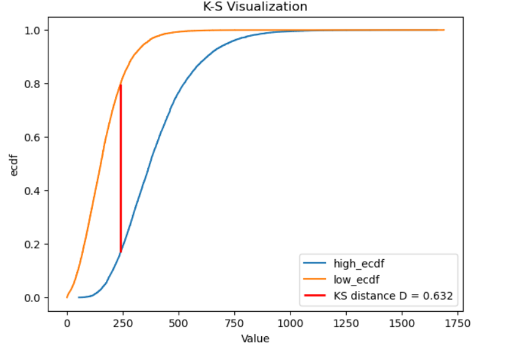

## Project Overview

This project analyzes Food.com recipes (2008–2018) and their user reviews to understand what makes recipes popular and how content features relate to preparation time and user satisfaction. By examining over 230,000 recipes and 1.1 million user interactions, we investigate the drivers behind recipe success and build predictive models for cooking duration.

## Dataset

- **RAW_recipes.csv**: ~230K recipes with metadata including name, tags, ingredients, steps, nutritional information, preparation time, and submission date
- **RAW_interactions.csv**: ~1.1M user interactions with ratings (1-5 stars) and free-text reviews linked to recipes

After data cleaning and filtering (removing outliers in preparation time and calories, filtering unrealistic nutritional values), the final dataset contains approximately 170,000 interactions.

The cleaned dataframe is shown below:

| name                                 |   minutes |   contributor_id | submitted   | tags                                                                                                                                                                                                                        | nutrition                                 |   n_steps | steps                                                                                                                                                                                                                                                                                                                                                                                                                                                                                                                                                                                                                                                                                                                                                                             | description                                                                                                                                                                                                                                                                                                                                                                       | ingredients                                                                                                                                                                    |   n_ingredients |          user_id | date       | review                                                                                                                                                                                                                                                                                                                                                                                                                                                                                |   avg_rating |   calories |   total_fat |   sugar |   sodium |   protein |   saturated_fat |   carbs |
|:-------------------------------------|----------:|-----------------:|:------------|:----------------------------------------------------------------------------------------------------------------------------------------------------------------------------------------------------------------------------|:------------------------------------------|----------:|:----------------------------------------------------------------------------------------------------------------------------------------------------------------------------------------------------------------------------------------------------------------------------------------------------------------------------------------------------------------------------------------------------------------------------------------------------------------------------------------------------------------------------------------------------------------------------------------------------------------------------------------------------------------------------------------------------------------------------------------------------------------------------------|:----------------------------------------------------------------------------------------------------------------------------------------------------------------------------------------------------------------------------------------------------------------------------------------------------------------------------------------------------------------------------------|:-------------------------------------------------------------------------------------------------------------------------------------------------------------------------------|----------------:|-----------------:|:-----------|:--------------------------------------------------------------------------------------------------------------------------------------------------------------------------------------------------------------------------------------------------------------------------------------------------------------------------------------------------------------------------------------------------------------------------------------------------------------------------------------|-------------:|-----------:|------------:|--------:|---------:|----------:|----------------:|--------:|
| 1 brownies in the world    best ever |        40 |           985201 | 2008-10-27  | ['60-minutes-or-less', 'time-to-make', 'course', 'main-ingredient', 'preparation', 'for-large-groups', 'desserts', 'lunch', 'snacks', 'cookies-and-brownies', 'chocolate', 'bar-cookies', 'brownies', 'number-of-servings'] | [138.4, 10.0, 50.0, 3.0, 3.0, 19.0, 6.0]  |        10 | ['heat the oven to 350f and arrange the rack in the middle', 'line an 8-by-8-inch glass baking dish with aluminum foil', 'combine chocolate and butter in a medium saucepan and cook over medium-low heat , stirring frequently , until evenly melted', 'remove from heat and let cool to room temperature', 'combine eggs , sugar , cocoa powder , vanilla extract , espresso , and salt in a large bowl and briefly stir until just evenly incorporated', 'add cooled chocolate and mix until uniform in color', 'add flour and stir until just incorporated', 'transfer batter to the prepared baking dish', 'bake until a tester inserted in the center of the brownies comes out clean , about 25 to 30 minutes', 'remove from the oven and cool completely before cutting'] | these are the most; chocolatey, moist, rich, dense, fudgy, delicious brownies that you'll ever make.....sereiously! there's no doubt that these will be your fav brownies ever for you can add things to them or make them plain.....either way they're pure heaven!                                                                                                              | ['bittersweet chocolate', 'unsalted butter', 'eggs', 'granulated sugar', 'unsweetened cocoa powder', 'vanilla extract', 'brewed espresso', 'kosher salt', 'all-purpose flour'] |               9 | 386585           | 2008-11-19 | These were pretty good, but took forever to bake.  I would send it ended up being almost an hour!  Even then, the brownies stuck to the foil, and were on the overly moist side and not easy to cut.  They did taste quite rich, though!  Made for My 3 Chefs.                                                                                                                                                                                                                        |            4 |      138.4 |          10 |      50 |        3 |         3 |              19 |       6 |
| 412 broccoli casserole               |        40 |            50969 | 2008-05-30  | ['60-minutes-or-less', 'time-to-make', 'course', 'main-ingredient', 'preparation', 'side-dishes', 'vegetables', 'easy', 'beginner-cook', 'broccoli']                                                                        | [194.8, 20.0, 6.0, 32.0, 22.0, 36.0, 3.0] |         6 | ['preheat oven to 350 degrees', 'spray a 2 quart baking dish with cooking spray , set aside', 'in a large bowl mix together broccoli , soup , one cup of cheese , garlic powder , pepper , salt , milk , 1 cup of french onions , and soy sauce', 'pour into baking dish , sprinkle remaining cheese over top', 'bake for 25 minutes or until cheese is lightly browned', 'sprinkle with rest of french fried onions and bake until onions are browned and cheese is bubbly , about 10 more minutes']                                                                                                                                                                                                                                                                             | since there are already 411 recipes for broccoli casserole posted to "zaar" ,i decided to call this one  #412 broccoli casserole.i don't think there are any like this one in the database. i based this one on the famous "green bean casserole" from campbell's soup. but i think mine is better since i don't like cream of mushroom soup.submitted to "zaar" on may 28th,2008 | ['frozen broccoli cuts', 'cream of chicken soup', 'sharp cheddar cheese', 'garlic powder', 'ground black pepper', 'salt', 'milk', 'soy sauce', 'french-fried onions']          |               9 |  29782           | 2008-12-31 | This was one of the best broccoli casseroles that I have ever made.  I made my own chicken soup for this recipe. I was a bit worried about the tsp of soy sauce but it gave the casserole the best flavor. YUM!   The photos you took (shapeweaver) inspired me to make this recipe and it actually does look just like them when it comes out of the oven.   Thanks so much for sharing your recipe shapeweaver. It was wonderful!  Going into my family's favorite Zaar cookbook :) |            5 |      194.8 |          20 |       6 |       32 |        22 |              36 |       3 |
| 412 broccoli casserole               |        40 |            50969 | 2008-05-30  | ['60-minutes-or-less', 'time-to-make', 'course', 'main-ingredient', 'preparation', 'side-dishes', 'vegetables', 'easy', 'beginner-cook', 'broccoli']                                                                        | [194.8, 20.0, 6.0, 32.0, 22.0, 36.0, 3.0] |         6 | ['preheat oven to 350 degrees', 'spray a 2 quart baking dish with cooking spray , set aside', 'in a large bowl mix together broccoli , soup , one cup of cheese , garlic powder , pepper , salt , milk , 1 cup of french onions , and soy sauce', 'pour into baking dish , sprinkle remaining cheese over top', 'bake for 25 minutes or until cheese is lightly browned', 'sprinkle with rest of french fried onions and bake until onions are browned and cheese is bubbly , about 10 more minutes']                                                                                                                                                                                                                                                                             | since there are already 411 recipes for broccoli casserole posted to "zaar" ,i decided to call this one  #412 broccoli casserole.i don't think there are any like this one in the database. i based this one on the famous "green bean casserole" from campbell's soup. but i think mine is better since i don't like cream of mushroom soup.submitted to "zaar" on may 28th,2008 | ['frozen broccoli cuts', 'cream of chicken soup', 'sharp cheddar cheese', 'garlic powder', 'ground black pepper', 'salt', 'milk', 'soy sauce', 'french-fried onions']          |               9 |      1.19628e+06 | 2009-04-13 | I made this for my son's first birthday party this weekend. Our guests INHALED it! Everyone kept saying how delicious it was. I was I could have gotten to try it.                                                                                                                                                                                                                                                                                                                    |            5 |      194.8 |          20 |       6 |       32 |        22 |              36 |       3 |
| 412 broccoli casserole               |        40 |            50969 | 2008-05-30  | ['60-minutes-or-less', 'time-to-make', 'course', 'main-ingredient', 'preparation', 'side-dishes', 'vegetables', 'easy', 'beginner-cook', 'broccoli']                                                                        | [194.8, 20.0, 6.0, 32.0, 22.0, 36.0, 3.0] |         6 | ['preheat oven to 350 degrees', 'spray a 2 quart baking dish with cooking spray , set aside', 'in a large bowl mix together broccoli , soup , one cup of cheese , garlic powder , pepper , salt , milk , 1 cup of french onions , and soy sauce', 'pour into baking dish , sprinkle remaining cheese over top', 'bake for 25 minutes or until cheese is lightly browned', 'sprinkle with rest of french fried onions and bake until onions are browned and cheese is bubbly , about 10 more minutes']                                                                                                                                                                                                                                                                             | since there are already 411 recipes for broccoli casserole posted to "zaar" ,i decided to call this one  #412 broccoli casserole.i don't think there are any like this one in the database. i based this one on the famous "green bean casserole" from campbell's soup. but i think mine is better since i don't like cream of mushroom soup.submitted to "zaar" on may 28th,2008 | ['frozen broccoli cuts', 'cream of chicken soup', 'sharp cheddar cheese', 'garlic powder', 'ground black pepper', 'salt', 'milk', 'soy sauce', 'french-fried onions']          |               9 | 768828           | 2013-08-02 | Loved this.  Be sure to completely thaw the broccoli.  I didn&#039;t and it didn&#039;t get done in time specified.  Just cooked it a little longer though and it was perfect.  Thanks Chef.                                                                                                                                                                                                                                                                                          |            5 |      194.8 |          20 |       6 |       32 |        22 |              36 |       3 |
| 412 broccoli casserole               |        40 |            50969 | 2008-05-30  | ['60-minutes-or-less', 'time-to-make', 'course', 'main-ingredient', 'preparation', 'side-dishes', 'vegetables', 'easy', 'beginner-cook', 'broccoli']                                                                        | [194.8, 20.0, 6.0, 32.0, 22.0, 36.0, 3.0] |         6 | ['preheat oven to 350 degrees', 'spray a 2 quart baking dish with cooking spray , set aside', 'in a large bowl mix together broccoli , soup , one cup of cheese , garlic powder , pepper , salt , milk , 1 cup of french onions , and soy sauce', 'pour into baking dish , sprinkle remaining cheese over top', 'bake for 25 minutes or until cheese is lightly browned', 'sprinkle with rest of french fried onions and bake until onions are browned and cheese is bubbly , about 10 more minutes']                                                                                                                                                                                                                                                                             | since there are already 411 recipes for broccoli casserole posted to "zaar" ,i decided to call this one  #412 broccoli casserole.i don't think there are any like this one in the database. i based this one on the famous "green bean casserole" from campbell's soup. but i think mine is better since i don't like cream of mushroom soup.submitted to "zaar" on may 28th,2008 | ['frozen broccoli cuts', 'cream of chicken soup', 'sharp cheddar cheese', 'garlic powder', 'ground black pepper', 'salt', 'milk', 'soy sauce', 'french-fried onions']          |               9 | 520830           | 2017-10-17 | 5 stars from my husband and son, my toughest critics. I used a 10-oz bag of chopped broccoli and a 10-oz bag of flowerettes which gave it more texture. Very good flavor and the smell while cooking was great. The sauce held it together without overwhelming the broccoli.                                                                                                                                                                                                         |            5 |      194.8 |          20 |       6 |       32 |        22 |              36 |       3 |

## Research Questions

1. **Do nutritional attributes—specifically protein content—correspond to meaningful differences in calorie distributions among recipes?**
2. **Which recipe features most strongly determine preparation time, and how accurately can we predict cooking duration using these features?**

## Key Findings

### 1. Exploratory Data Analysis

**Recipe Characteristics:**
- Most recipes take less than 400 minutes to prepare, with a clear concentration under 200 minutes (Fig 1)
- Calorie distribution peaks between 100-1000 calories, consistent with typical recipes (Fig 2)
- Nutritional values (protein, fat, sodium, carbs) vary widely but most recipes fall within reasonable ranges

The distributions of preparation times and calories among the recipes:

Fig 1:
<iframe
  src="assets/preparation.html"
  width="800"
  height="600"
  frameborder="0"
></iframe>

Fig 2:
<iframe
  src="assets/calories.html"
  width="800"
  height="600"
  frameborder="0"
></iframe>

**Text Analysis:**
- Most frequent unigrams in recipe names: "chicken," "easy," "best," "sauce," "quick" (Fig 3)
- Most frequent bigrams: "crock pot," "peanut butter," "gluten free"
- Top tags: "easy," "quick," "30-minutes-or-less," "healthy," "vegetarian," "desserts" (Fig 4)

This suggests users prioritize recipes that are quick, simple, and feature popular ingredients.

Fig 3:
<iframe
  src="assets/top_unigrams.html"
  width="800"
  height="600"
  frameborder="0"
></iframe>

Fig 4:
<iframe
  src="assets/top_tags.html"
  width="800"
  height="600"
  frameborder="0"
></iframe>

### 2. Bivariate Analysis

**Rating Relationships:**
- No significant relationship between calories and user ratings—recipes of all calorie levels receive similar ratings (Fig 5)
- Recipe complexity (number of steps and ingredients) shows weak correlation with ratings
- Recipes submitted per year show a clear declining trend from 2008 to 2018, indicating decreasing platform engagement (Fig 6)

Fig 5:
<iframe
  src="assets/box_calories_ratings.html"
  width="800"
  height="600"
  frameborder="0"
></iframe>

Fig 6:
<iframe
  src="assets/recipes_yearly.html"
  width="800"
  height="600"
  frameborder="0"
></iframe>

**Feature Correlations:**
- Moderate positive correlation (0.39) between number of ingredients and number of steps, suggesting complex recipes tend to have both more ingredients and steps (Fig 7)
- Nutritional attributes show moderate intercorrelation, indicating recipes higher in one nutrient tend to be higher in others as well

Fig 7:
<iframe
  src="assets/features_correlations.html"
  width="800"
  height="600"
  frameborder="0"
></iframe>

### 3. Assessment of Missingness

**Finding**: Approximately 2,000 recipes (~3.6%) are missing average ratings.

**Permutation Test for Missingness Dependency**:
- Null Hypothesis: Missingness is independent of recipe duration
- Test statistic: Absolute difference in mean minutes between missing and present ratings
- **Result**: p-value < 0.001 (strong evidence of MAR)
- **Conclusion**: Missingness depends on recipe duration—longer recipes are less likely to be rated

**Imputation Strategy**: Missing ratings were imputed using the mean rating for each duration quartile, accounting for the observed dependency.

### 4. Hypothesis Testing: Protein Content and Calorie Distribution

**Question**: Do high-protein and low-protein recipes have the same calorie distribution?

**Method**: Two-sample Kolmogorov–Smirnov (K-S) test comparing empirical cumulative distribution functions

**Results**:
- Test p-value: **< 0.001** (highly significant)
- **Conclusion**: Reject null hypothesis. High-protein and low-protein recipes have **statistically distinct** calorie distributions.
- High-protein recipes (≥16% protein) tend to cluster at different calorie levels than low-protein recipes (<16% protein) ()

### 5. Prediction Model: Estimating Recipe Duration

**Problem Framing**: Regression task to predict recipe preparation time (`minutes`) using recipe features

**Feature Engineering**:
- Numeric features: number of steps, number of ingredients
- Categorical features: tags transformed into binary indicators (preparation, dietary, easy, occasion, main-dish, vegetables, meat)
- Advanced features: polynomial interactions, engineered ratios (steps/ingredients)

**Model Comparison**:

| Model | RMSE |
|-------|------|
| Baseline Linear Regression | 53.0 |
| Linear + Feature Engineering | 52.2 |
| Polynomial Regression | 52.5 |
| **Random Forest (Final)** | **47.0** |

**Best Model**: Random Forest Regressor (200 estimators, max depth 10)

- Achieves **RMSE of 47 minutes** on test set
- Substantially outperforms linear approaches, indicating recipe duration involves complex, nonlinear relationships
- Categorical features (tags) are more predictive than numeric features alone

### 6. Fairness Analysis

**Question**: Does the model perform equitably across different recipe types?

**Method**: Compared model performance for meat-based vs. vegetable-based recipes using permutation testing

**Results**:
- **Meat-based recipes RMSE**: 66.3 minutes
- **Vegetable-based recipes RMSE**: 44.8 minutes
- **Observed difference**: 21.5 minutes
- **Permutation test p-value**: < 0.001 (statistically significant)

**Conclusion**: The model exhibits **significant fairness concerns**. It predicts duration much less accurately for meat-based recipes, suggesting the model may be biased toward vegetable-based recipes. Further investigation and mitigation strategies are recommended.

## Key Insights

1. **User Preferences**: Recipe popularity is driven more by perceived ease and ingredient appeal than by nutritional content
2. **Protein-Calorie Relationship**: Protein content is a meaningful predictor of calorie distribution, with clear statistical significance
3. **Preparation Time Drivers**: Complex, nonlinear interactions between recipe features determine cooking duration—tree-based models capture these better than linear approaches
4. **Fairness Issues**: The prediction model has systematic bias against meat-based recipes, highlighting the importance of fairness evaluation in ML systems

## Files

- `template.ipynb`: Full analysis notebook with code, visualizations, and detailed explanations
- `dsc80_utils.py`: Utility functions for analysis
- `RAW_recipes.csv`: Recipe metadata
- `RAW_interactions.csv`: User ratings and reviews
- `README.md`: This summary document

## Website
For an interactive version of this analysis, visit: [https://r-marda.github.io/analysis-of-foodcom-recipes-interactions/](https://r-marda.github.io/analysis-of-foodcom-recipes-interactions/)
